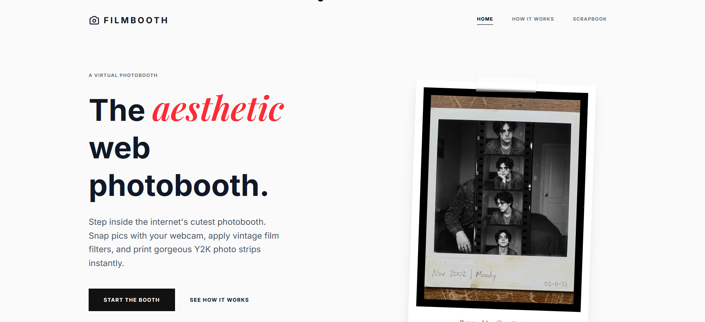

<div align="center">
  
  <h1>FILMBOOTH</h1>
  <p><b>The aesthetic web photobooth. Free, private, and online.</b></p>
  <br />
  <a href="https://thephotobooth.in"><strong>📸 View the Live Website</strong></a>
</div>

<br />



## 🎞️ About The Project

FILMBOOTH is a vintage-inspired virtual photobooth built directly for the web. It allows users to snap aesthetic pictures using their webcam, apply carefully crafted film filters (like Silver Halide and Portra Warm), and instantly generate beautiful Y2K-style photo strips. 

We built this to bring the nostalgia of physical photobooths to the internet—without the hassle.

- **100% Private:** All image processing happens locally in your browser. No photos are ever uploaded to a server.
- **No Signups, No Ads:** Just pure, uninterrupted memory making.
- **Archival Quality:** Export your strips as high-res digital files ready for physical printing.

## 📸 Features

- **Live Camera Viewfinder:** Built with WebRTC to stream camera feeds directly to a styled canvas.
- **Custom Film Processing:** Authentic-looking grain overlays, contrast adjustments, and color grading.
- **Physical Strip Generation:** Automatically frames 4 shots into a classic vertical photo strip.
- **Download & Share:** Instantly download your customized strips to your device.

## 🛠️ Built With

- **HTML5 & CSS3**
- **Vanilla JavaScript** (Canvas API, MediaDevices API)
- **Tailwind CSS** (for utility-first styling)

## 🚀 Running Locally

To get a local copy up and running, follow these simple steps.

1. Clone the repository:
   ```sh
   git clone https://github.com/Shubham-Pochhali/filmbooth.git
   ```
2. Navigate to the directory:
   ```sh
   cd filmbooth
   ```
3. Serve the directory locally. (Due to browser security restrictions around the Camera API, you should use a local development server rather than just opening the file directly):
   ```sh
   npx serve .
   # or
   python -m http.server
   ```
4. Open `http://localhost:3000` (or `http://localhost:8000`) in your browser.

## ✉️ Connect

Created by **Shubham Pochhali** for the aesthetic internet.

- **Website:** [thephotobooth.in](https://thephotobooth.in)
- **LinkedIn:** [Shubham Pochhali](https://www.linkedin.com/in/shubham-pochhali-681036285/)
- **GitHub:** [@Shubham-Pochhali](https://github.com/Shubham-Pochhali)
- **Email:** pochhali.dev@gmail.com
